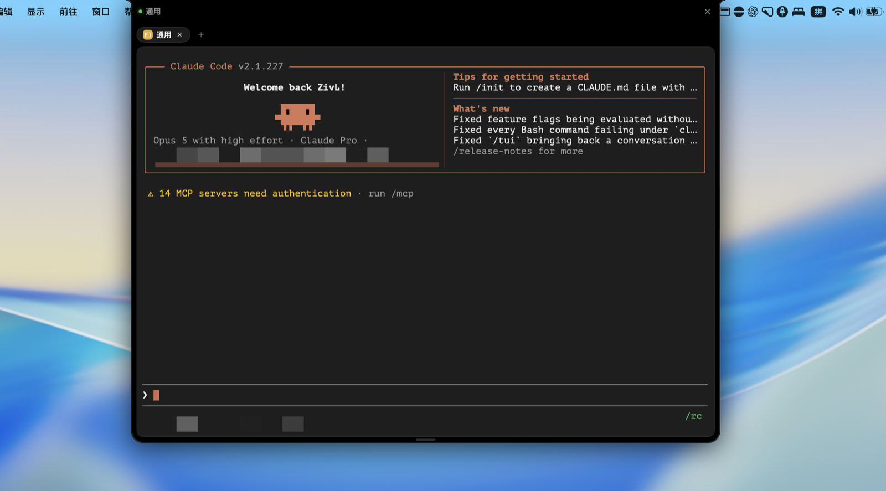

# NotchAgent

macOS 刘海区的灵动岛终端。常驻屏幕顶部，在 Notch 里开真正的 shell，可以跑 Claude Code、Grok、Codex、Gemini CLI 或任何命令行工具。



## 特性

- **真终端** — `$SHELL -l` 起登录 shell，PTY 交互与 Terminal.app 一致
- **灵动岛四态** — idle → running → notice → expanded，贴合刘海区动画切换
- **多 Tab** — 同时开多个会话，横向滚动切换
- **Claude Code Hook 集成** — 包装脚本透明加 `--settings`，收起态显示实时进度（正在读哪个文件、在跑什么工具）
- **终端主题** — 内置 Default / Dracula / One Light，支持导入 iTerm `.itermcolors` 和 Ghostty 配色
- **拖拽调大小** — 岛体可拖拽展开，边缘热区 4pt 内外各半
- **偏好设置** — 悬停行为、主题、字体、字号

## 构建

需要 Xcode 16+、macOS 15+、Personal Team 签名（不能 ad-hoc）。

```sh
# 首次需要 Metal 工具链（SwiftTerm 1.15 依赖）
xcodebuild -downloadComponent MetalToolchain

# 构建
xcodebuild -project NotchAgent/NotchAgent.xcodeproj -scheme NotchAgent -configuration Debug build

# 运行
open ~/Library/Developer/Xcode/DerivedData/NotchAgent-*/Build/Products/Debug/NotchAgent.app

# 测试
xcodebuild test -project NotchAgent/NotchAgent.xcodeproj -scheme NotchAgent -destination 'platform=macOS'
```

## 架构

| 目录 | 职责 |
|---|---|
| `Geometry/` | 量刘海与菜单栏（`ScreenGeometry`）、画内凹拐角形状（`NotchShape`） |
| `Window/` | 窗口层级、命中测试、拖拽热区光标 |
| `Island/` | 四态机、视图状态、尺寸推导、主题、各块 UI |
| `Session/` | PTY 会话、claude 包装脚本、Tab 持久化、退出收尾、键位翻译、偏好存储 |
| `Status/` | Hook 通道（BSD socket + `nc -U`）、状态文案 |

## 工作方式

新建 Tab 选一个项目目录，输入命令（或留空直接开 shell）。在岛里输 `claude` 会走包装脚本，自动把 hook 配置带上——收起岛时能看到 Claude Code 的实时进度；输别的命令就是普通终端。

```
用户在岛里输入 claude
  → 走 Application Support/NotchAgent/bin/claude（包装脚本）
  → 自动加 --settings（指向 island-hooks.json）
  → Hook 事件经 BSD socket 回到岛
  → 收起态显示进度文案
```

## 许可

MIT
